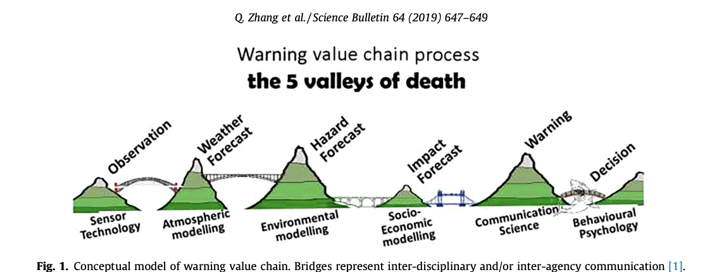

```{r setup, include=FALSE}
knitr::opts_chunk$set(echo = TRUE)
```

## Welcome

-   Who are you?
-   How do you use R?
-   Why are you interested in natural disasters?
-   How do you learn new things in R?
-   What do you hope to get out of today?

## Goals for today

Create visualisations of:

-   Changing temperature extremes

-   Weather/hazard forecasts: Streamflow

-   Impact forecasts: Road closures

<!-- ## Changing temperature extremes -->

<!-- {width="600"} -->

## Value-chain

<center>
{
width=95% }
</center>


